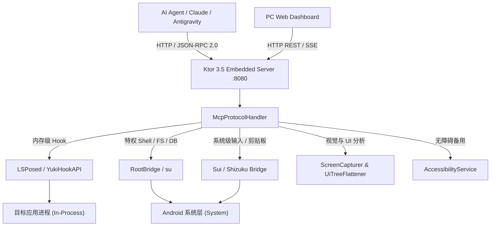

# 🤖 AndroidMCP

<div align="center">


<p align="center">
  <b>首个原生运行于 Android 系统的特权级 Model Context Protocol (MCP) 服务端</b><br>
  融合 <b>LSPosed 内存注入 + Root 特权 + Sui/Shizuku 跨进程 + 无障碍服务</b>，为 AI Agent 赋予完全掌控 Android 系统的超级智能体能力。
</p>

[✨ 核心特性](#-核心特性) • [🛠️ MCP 工具清单](#️-mcp-工具清单) • [🖥️ Web 控制台](#️-web-控制台) • [🚀 快速开始](#-快速开始) • [🏗️ 架构设计](#️-架构设计)

</div>

---

## 🌟 项目简介

**AndroidMCP** 是一个直接部署在 Android 设备上的开源服务框架，实现了标准 [Model Context Protocol (MCP)](https://modelcontextprotocol.io/) 规范。

它让各类大语言模型 Agent（如 **Claude Desktop**, **Google Antigravity**, **Cline**, **Cursor**, **Roocode** 等）能够通过标准 JSON-RPC 2.0 协议直接与真实 Android 设备进行全方位的智能交互，涵盖从 **视觉感知、UI 触控自动化、特权指令执行** 到 **目标 App 内部内存反射与逆向提取** 的全流程操作。

---

## ✨ 核心特性

### 1. 🧬 四维全权限与智能降级架构
- **LSPosed / Xposed 进程内注入**：深入目标应用进程内部，直接反射调用 Java/Kotlin 方法、读写私有 Field 变量、实时抓取原始 View / Jetpack Compose 语义树。
- **Root 级超级特权**：直接穿透应用沙箱读写 `/data/data/<pkg>/` 私有 SQLite 数据库与 SharedPreferences XML 配置，动态接管系统硬件（Wi-Fi、代理、分辨率、权限）。
- **Sui / Shizuku 跨进程特权**：无需触发无障碍延迟，高保真分发毫秒级触控、滑动、物理按键及全系统剪贴板读写。
- **Accessibility 无障碍服务**：免 Root 机型的全自动 UI 节点抓取与手势分发兜底保障。

### 2. 👁️ 视觉感知与 Set-of-Mark (SoM) 标注
- **实时 SoM 目标标号**：截图中自动为每个可交互组件渲染高对比度数字角标（Set-of-Mark），让多模态视觉大模型实现 100% 精准的目标指代。
- **Compact Token-Saving Prompt**：独创 UI 树扁平化算法，将冗长的 XML 视图树压缩为对 LLM 极其友好的紧凑文本结构，大幅降低 Token 开销。

### 3. 🖥️ 现代化拟物 Web 控制台
- 访问 `http://<设备IP>:8080/` 即可直接在电脑浏览器中进行沉浸式远程操作：
  - **真实拟物手机屏幕镜像**：支持鼠标单击即点、拖动即滑动、实时光标坐标反馈、物理按键悬浮栏。
  - **5 大超级工作台 Tab**：快捷文本/应用控制、UI 树实时搜索与点击、特权 Shell 终端、MCP 工具在线 Playground、实时 Logcat 日志过滤。

---

## 🛠️ MCP 工具清单 (16+ 原生超级工具)

### 🎯 智能 UI 触控与感知
| 工具名称 | 参数 | 说明 |
| :--- | :--- | :--- |
| `get_ui_hierarchy` | `annotate_som?: boolean` | 智能抓取当前屏幕 UI 树（优先 LSPosed 内存树 -> 其次 A11y -> 兜底 UiAutomator dump），生成 Token 紧凑格式。 |
| `click_by_selector` | `text?`, `resource_id?`, `content_desc?`, `class_name?`, `match_type?` | **智能选择器点击**：无需计算坐标，直接根据文字或 ID 自动查找目标节点、计算中心点并完成点击。 |
| `capture_screenshot` | `quality?: int`, `annotate_som?: boolean` | 抓取屏幕图像（支持 Base64 返回与 SoM 角标实时绘制）。 |
| `tap` | `x: float`, `y: float`, `element_id?: int` | 模拟屏幕绝对坐标点击或通过 SoM ID 点击。 |
| `swipe` | `x1`, `y1`, `x2`, `y2`, `duration_ms?: int` | 模拟任意轨迹的平滑滑动与手势滚动。 |
| `input_text` | `text: string` | 输入文本（支持完整 Unicode 与中文字符直接注入）。 |
| `press_key` | `key: string` | 模拟物理按键（`BACK`, `HOME`, `RECENTS`, `POWER`, `VOLUME_UP`, `VOLUME_DOWN` 等）。 |

### 🕵️‍♂️ 深度逆向与数据提取 (Root & LSPosed)
| 工具名称 | 参数 | 说明 |
| :--- | :--- | :--- |
| `hook_dump_sqlite` | `package_name`, `db_name?`, `query?`, `limit?: int` | **私有数据库查询**：直接穿透沙箱读取目标 App 的 SQLite 数据库并以 JSON 表格返回。 |
| `hook_dump_shared_prefs` | `package_name`, `file_name?`, `key?` | **私有偏好配置解析**：提取并解析目标 App 的 SharedPreferences XML 为结构化 JSON。 |
| `hook_inspect_activity` | `package_name?` | [LSPosed] 实时分析当前前台 Activity 的类结构、所有属性与已加载组件。 |
| `hook_call_method` | `package_name`, `class_name?`, `method_name`, `params?: string[]` | [LSPosed] 在目标 App 内存中反射执行任意 Java/Kotlin 方法。 |
| `hook_set_field` | `package_name`, `class_name?`, `field_name`, `field_value` | [LSPosed] 在目标 App 内存中动态篡改私有/公开变量值。 |
| `hook_get_view_tree` | `package_name` | [LSPosed] 直接从目标 App 的 `DecorView` 获取高保真 View 与 Compose 语义树。 |

### 📱 系统与特权控制
| 工具名称 | 参数 | 说明 |
| :--- | :--- | :--- |
| `manage_clipboard` | `action: 'get' \| 'set'`, `text?: string` | 全系统剪贴板读取与写入，不受前台焦点限制。 |
| `system_control` | `action`, `param?` | 深度系统管控（`wifi_on`/`off`, `set_proxy`, `airplane_on`, `set_screen_density`, `grant_all_permissions` 等）。 |
| `system_file_ops` | `action: 'read' \| 'write' \| 'list' \| 'delete'`, `path`, `content?`, `as_base64?: boolean` | 对系统分区与私有沙箱进行任意文件读写和管理。 |
| `send_intent` | `type`, `action`, `data_uri?`, `package_name?`, `extras?: object` | 向系统发送任意 Activity / Broadcast / Service Intent。 |
| `execute_shell` | `command: string`, `use_root?: boolean` | 执行 Shell 脚本指令。 |
| `launch_app` / `stop_app` / `clear_app_data` | `package_name: string` | 应用生命周期控制与数据重置。 |
| `get_device_info` / `get_recent_logs` | - | 获取硬件与特权状态信息 / 实时抓取过滤 Logcat 日志。 |

---

## 🖥️ Web 控制台

启动服务后，同一局域网下的任意电脑浏览器直接访问：

```text
http://<手机IP>:8080/
```

- 包含与手机 1:1 响应的 **实时画布（Canvas/Mirror）**，支持鼠标手势直接触控与拖拽；
- 集成 **5 大桌面级控制台 Tab**（快捷控制、UI 布局树检索、Root 终端、MCP 工具调试台、实时 Logcat）。

---

## 🚀 快速开始

### 1. 设备环境准备
- **操作系统**：Android 8.0 ~ Android 16+
- **推荐环境**：
  - Magisk / KernelSU / APatch（已获取 Root 权限）
  - LSPosed 框架（推荐在作用域中勾选“系统框架”或目标测试应用）
  - Sui 或 Shizuku（提供高性能跨进程 Binder）

### 2. 编译与安装
```bash
# 编译并签名生成 Release 优化包 (仅 ~2.7MB)
./gradlew assembleRelease

# 安装至测试机
adb install -r app/build/outputs/apk/release/AndroidMCP_v*.apk
```

### 3. 启动 MCP 服务
- **方式一（App 界面）**：在手机上打开 AndroidMCP 应用，点击首页的 **「启动 MCP 服务」** 按钮；
- **方式二（ADB 命令行静默启动）**：
  ```bash
  adb shell "su -c am start-foreground-service -a com.wzvideni.androidmcp.ACTION_START -n com.wzvideni.androidmcp/.server.McpForegroundService --ei extra_port 8080"
  ```

### 4. 接入 MCP 客户端

在您的 MCP 客户端配置文件（如 `claude_desktop_config.json` 或 `settings.json`）中添加配置：

```json
{
  "mcpServers": {
    "android": {
      "type": "http",
      "url": "http://<手机IP>:8080/mcp"
    }
  }
}
```

---

## 🏗️ 架构设计



---

## 📄 开源许可证

本项目基于 [Apache 2.0 License](LICENSE) 开源。
